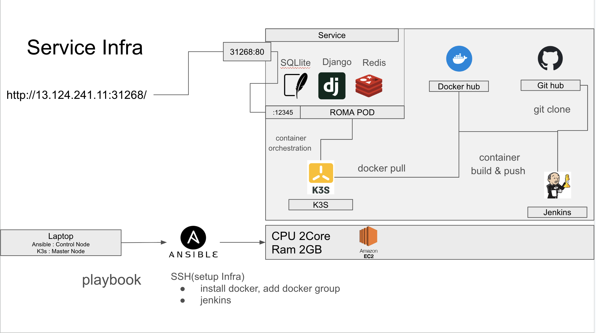
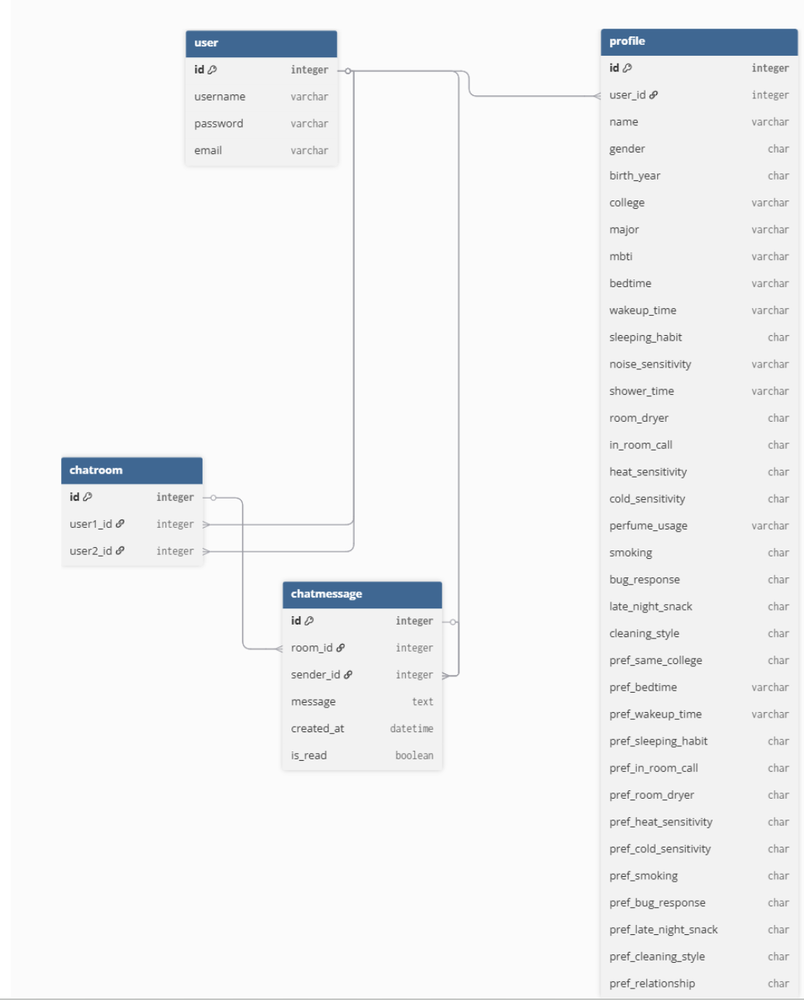
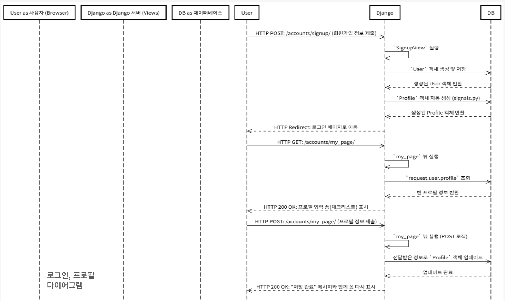
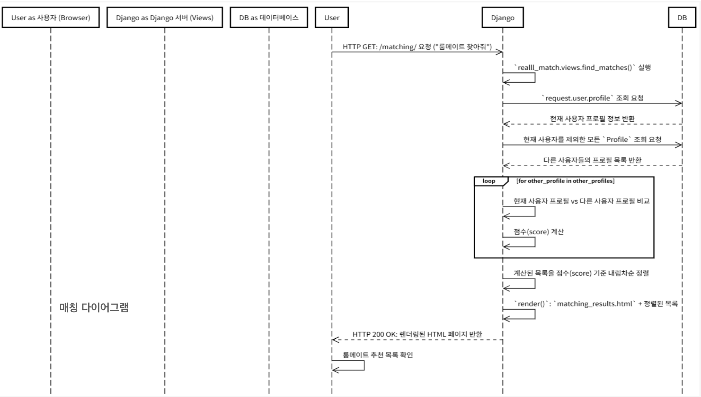
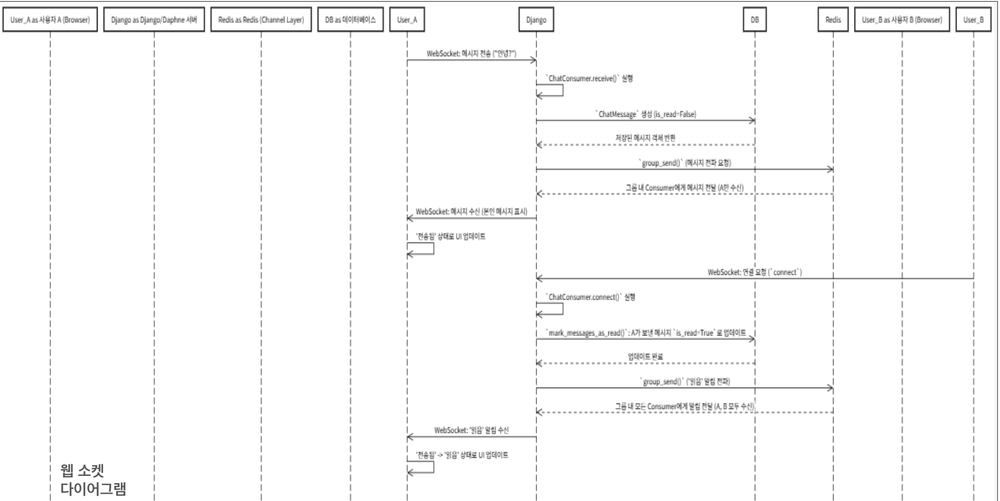

# ROMA

## [버그 기록](https://docs.google.com/presentation/d/1H_awmql93YOD6v-1pSeu13CaCOZjtBIWA9208dpQGys/edit?usp=sharing)

## 시스템 설계 다이어그램

1. **서비스 인프라 아키텍처**

**인프라 생성 시 고려 및 목표한 점**
* 개발지원 비용이 없다는 점을 고려하여 최대한 적은 비용으함 서비스를 배포해야함
* 도메인을 구매하는 것이 현실적으로 불가능하여 Route 53을 사용하지 않았음.
* ALB(Application Load Balancer)를 사용하면 추가적인 비용이 발생하여 클러스터의 IP를 이용하여 배포하고 서비스하지 않는 포트는 모두 방화벽으로 보호하는 방식으로 서비스를 배포.
* 가장 빠르게 버그를 찾을 수 있고, 가장 빠르게 개발한 코드의 동작을 확인학 위해 자동적으로 서비스에 배포 될 수 있도록 CICD파이프라인 구성
* 모든 인프라는 코드를 기반으로 생성되고 자동화 되는 것을 목표(인스턴스의 확장 혹은 축소를 고려)

2. **ERD**

**핵심 엔티티 구성**
총 4개로 구성
* User: 시스템의 기본 사용자 정보(ID, 비밀번호)를 담고 있음
* Profile: 사용자의 성향(취침 시간, MBTI, 흡연 여부 등)을 담은 확장 테이블
* ChatRoom: 사용자 간의 대화가 이뤄지는 공간
* ChatMessage: 채팅방 안에서 주고받은 실제 메시지 내용

**관계**
* User - Profile (1:1 관계):
    * 사용자당 1개의 프로필만 가짐
    * Django의 OneToOneField(FOREIGN KEY와 UNIQUE를 이용하여 1:1관계 강제함)를 사용하여 구현
* User - ChatRoom (M:N 관계):
    * 한 명의 유저는 여러 채팅방에 참여할 수 있고, 하나의 채팅방에는 여러 유저(참여자)가 존재
    * ManyToManyField를 통해 유연하게 대화 상대를 연결

* ChatRoom - ChatMessage (1:N 관계):
    * 하나의 채팅방에는 수많은 메시지가 쌓임
    * ForeignKey로 연결되어 있으며, 방이 삭제되면 관련 메시지도 함께 삭제(on_delete=CASCADE)되도록 관리

* User - ChatMessage (1:N 관계):
    * 메시지 입장에서는 누가 보냈는지(발신자)를 알아야 하므로 User와 연결

**ERD를 설계할 때 특히 신경 쓴 부분**

* 확장성 있는 프로필 설계: 유저 기본 정보와 서비스 특화 정보를 분리하여 관리 효율성을 높이기 위해 매칭 알고리즘의 핵심인 성향 데이터를 User 테이블에 직접 넣지 않고 Profile로 분리
* 데이터 무결성(Integrity): 채팅방의 참여자를 정확히 2명으로 제한하거나, 메시지의 읽음 여부(is_read)를 저장하여 실시간 통신 환경에서도 데이터 상태를 정확히 추적할 수 있게 설계

3. **로그인/프로필 시퀀스**

4. **매칭 로직**

5. **웹소켓 구조**

## API & Route map
| 기능         | HTTP Method | URL 경로                 | 설명                                                                     |   |
|------------|-------------|------------------------|------------------------------------------------------------------------|---|
| 홈 페이지      | GET         | /                      | 로그인 후 메인 페이지를 보여줍니다.                                                   |   |
| 회원가입       | GET, POST   | /accounts/signup/      | GET: 회원가입 폼을 보여줍니다.   POST: 사용자 정보를 받아 계정을 생성합니다.                   |   |
| 로그인        | GET, POST   | /accounts/login/       | GET: 로그인 폼을 보여줍니다.   POST: 사용자 인증을 수행합니다.                           |   |
| 로그아웃       | GET         | /accounts/logout/      | 로그아웃을 수행하고 홈으로 리다이렉트합니다.                                               |   |
| 마이페이지(프로필) | GET, POST   | /accounts/my_page/     | GET: 현재 사용자의 프로필(체크리스트)을 보여줍니다.   POST: 수정된 프로필 정보를 DB에 저장합니다.      |   |
| 룸메이트 매칭    | GET         | /matching/             | 현재 사용자의 프로필을 기반으로 매칭 점수가 높은 다른 사용자 목록을 보여줍니다.                          |   |
| 채팅 목록      | GET         | /chat/                 | 현재 사용자가 참여 중인 모든 채팅방 목록과 사용자 검색창을 보여줍니다.                               |   |
| 사용자 검색     | POST        | /chat/search/          | Request Body: username={검색할_아이디}   ID로 사용자를 검색하여 해당 채팅방으로 리다이렉트합니다. |   |
| 채팅방 입장     | GET         | /chat/{other_user_pk}/ | 특정 사용자(other_user_pk)와의 1:1 채팅방에 입장합니다.                                |   |
|            |             |                        |                                                                        |   |